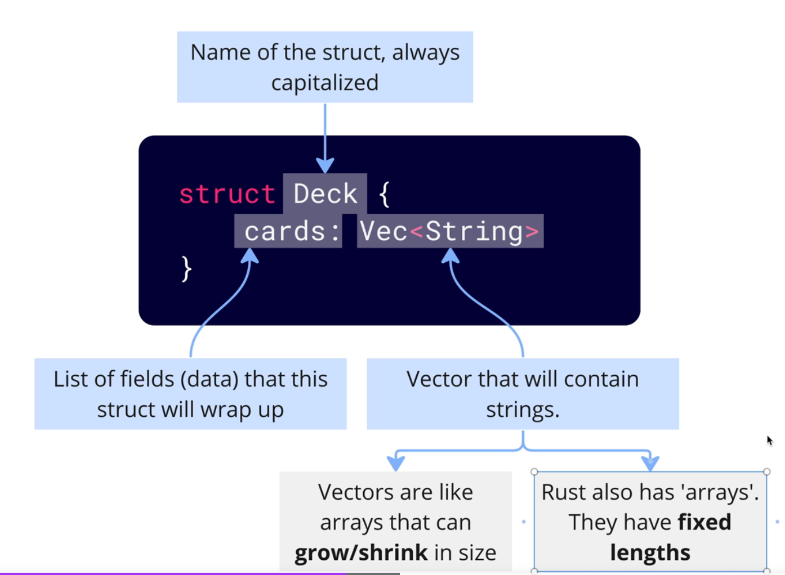
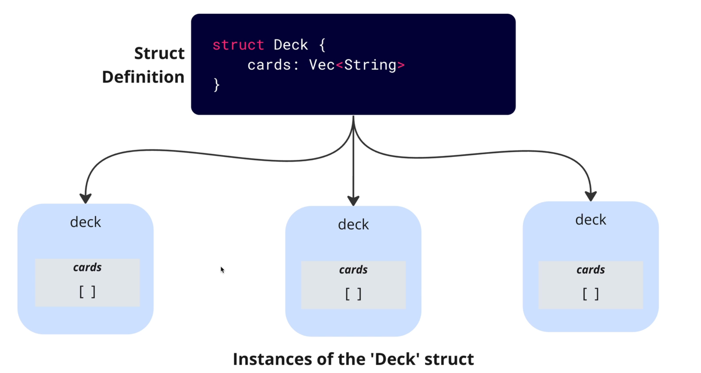
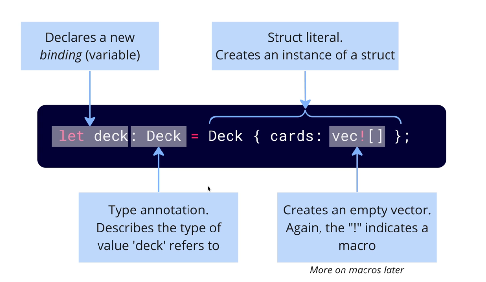
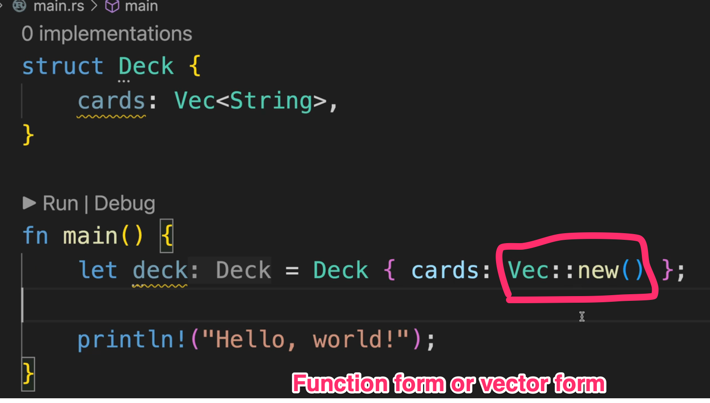
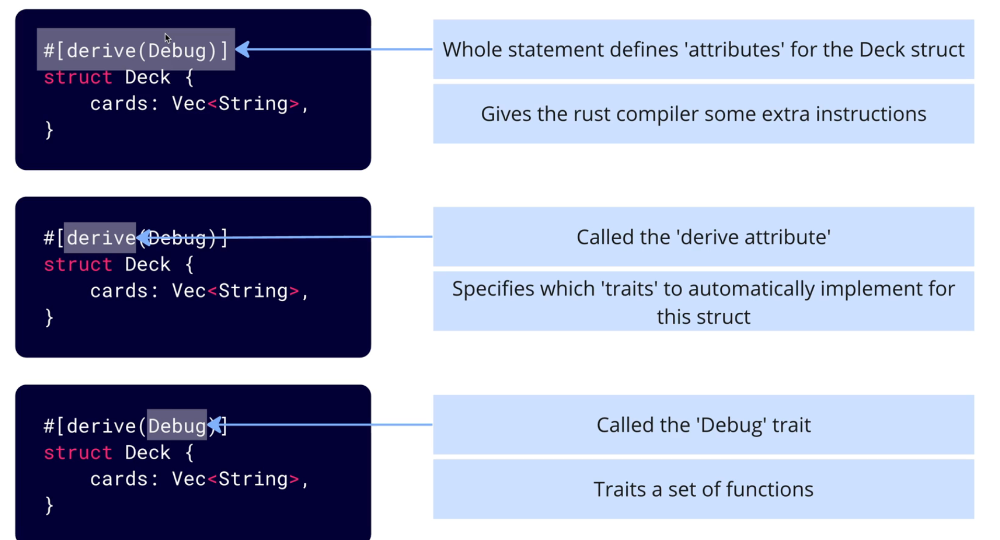
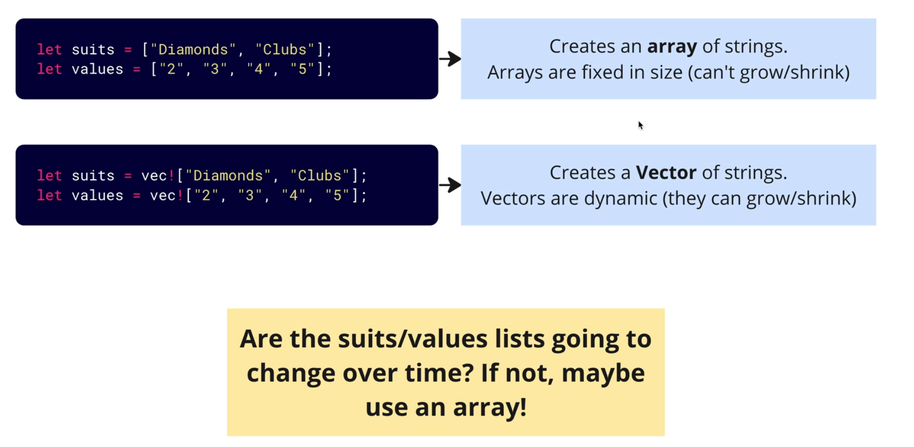

# Rust

# print!
````
! -> macro just like functions.
Variables are bindings

````

### Struct


#### Many instances


#### Declaration



````
Function form or the macro both are the same. 


````

#### Function form



#### Struct attributes 

````

Telling the structs to additional behaviour to it. 
Struct attributes
Add derive attribute
Debug trait.. 
Trait is a set of functions.

````




#### Array vs Vector

